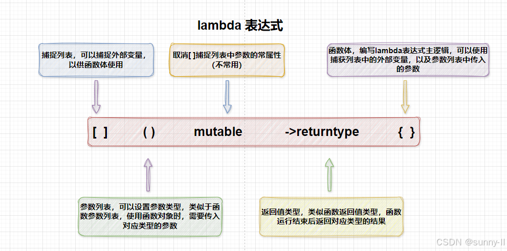
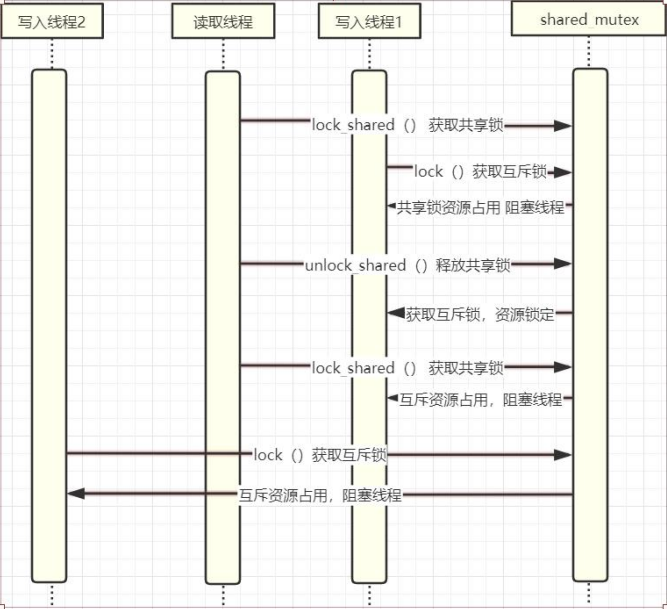
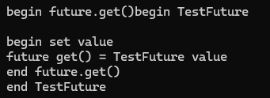

# 基础
## 2.3.3 lambda临时函数作为线程函数入口函数

> **lambda表达式定义**
>`[capture list] (parameter list) -> return type { function body }` 
> * **capture list** 是捕获列表，用于指定 Lambda表达式可以访问的外部变量，以及是按值还是按引用的方式访问。捕获列表可以为空，表示不访问任何外部变量，也可以使用默认捕获模式 & 或 = 来表示按引用或按值捕获所有外部变量，还可以混合使用具体的变量名和默认捕获模式来指定不同的捕获方式。
> * **parameter list** 是参数列表，用于表示 Lambda表达式的参数，可以为空，表示没有参数，也可以和普通函数一样指定参数的类型和名称，还可以在 c++14 中使用 auto 关键字来实现泛型参数。
> * **return type** 是返回值类型，用于指定 Lambda表达式的返回值类型，可以省略，表示由编译器根据函数体推导，也可以使用 -> 符号显式指定，还可以在 c++14 中使用 auto 关键字来实现泛型返回值。
> * **function body** 是函数体，用于表示 Lambda表达式的具体逻辑，可以是一条语句，也可以是多条语句，还可以在 c++14 中使用 constexpr 来实现编译期计算。
> 
> 
>> **最简单的lambda表达式:** `[]{}`
>> **简单的lambda表达式:** `int ret = [](int x, int y)->int { return x + y; }(1, 2);`我觉得很像go中的闭包

# 多线程通信与同步
## 多线程状态
### 线程状态说明
* **初始化（Init）**：该线程正在被创建。
* **就绪（Ready）**：该线程在就绪列表中，等待 CPU 调度。
* **运行（Running）**：该线程正在运行。
* **阻塞（Blocked）**：该线程被阻塞挂起。Blocked 状态包括：**pend**(锁、 事件、信号量等阻塞)、**suspend**（主动 pend）、**delay**(延时阻塞)、 **pendtime**(因为锁、事件、信号量时间等超时等待)
* **退出(Exit)** : 该线程运行结束，等待父线程回收其控制块资源。
### 竞争状态（Race Condition）和临界区（Critical Section）
> 竞争状态（Race Condition）

    多线程同时读写共享数据

> 临界区（Critical Section）

    读写共享数据的代码片段

避免竞争状态策略， 对临界区进行保护，同时只能有一个线程进入临界区

## 互斥体和锁 mutex
### 互斥锁 mute
**lock()** 获取锁资源，如果没有则阻塞等待
**trylock()** 可以监视到获取锁的过程，是非阻塞的
```c++
#include<thread>
#include<mutex>
static mutex mux;
void TestThread()
{
    mux.lock();
    //临界区
    mux.unlock();
}
void main()
{
    for(int i=0;i<10;i++)
    {
        thread th(TestThread());
        th.detach();//主进程不阻塞等待线程
    }
}
```
### 互斥锁的坑_线程抢占不到资源
* 锁释放后立即上锁
```c++
mutex mux;
void ThreadMainMux(int i)
{
    for (;;)
    {
        mux.lock();
        cout << i << "[in]" << endl;
        this_thread::sleep_for(1000ms);
        mux.unlock();
    }
}
int main(int argc,char *argv[])
{
    for (int i = 0; i < 3; i++)
    {
    thread th(ThreadMainMux, i+1);
    th.detach();
    }
    //....
}
```
输出结果：
```c++
1[in]
1[in]
1[in]
1[in]
1[in]
1[in]
1[in]
1[in]
```
* 锁释放后等待一段时间后上锁
```c++
mutex mux;
void ThreadMainMux(int i)
{
    for (;;)
    {
        mux.lock();
        cout << i << "[in]" << endl;
        this_thread::sleep_for(1000ms);
        mux.unlock();
        this_thread::sleep_for(1ms);
    }
}
```
输出结果：
```c++
1[in]
2[in]
3[in]
1[in]
2[in]
3[in]
```
代码简洁但是带来问题，不方便调试
### 超时锁 timed_mutex
**timed_mutex** (避免长时间死锁)
* 可以记录锁获取情况，多次超时，可以记录日志，获取错误情况
**timed_mutex::tmux.try_lock_for(超时时间)** 如果超过设定时间，则执行以下操作
```c++
timed_mutex tmux;
void ThreadMainTime(int i)
{
    for (;;)
    {
        if (!tmux.try_lock_for(milliseconds(1000)))
        {
            cout << i << "[try_lock_for] timeout" << endl;
            continue;
        }
        cout << i << "[in]" << endl;
        this_thread::sleep_for(2000ms);
        tmux.unlock();
        this_thread::sleep_for(1ms);
    }
}
```
### 递归锁 recursive_mutex
递归锁可重入：**recursive_mutex** 和 **recursive_timed_mutex** 用于业务组合
* 同一个线程中的同一把锁可以锁多次。避免了一些不必要的死锁
* 组合业务 用到同一个锁
```c++
recursive_mutex rmux;
void Task1()
{
    rmux.lock();
    // 组合业务 用到同一个锁
    cout << "task1 [in]" << endl;
    rmux.unlock();
}
void Task2()
{
    rmux.lock();
    // 组合业务 用到同一个锁
    cout << "task2 [in]" << endl;
    rmux.unlock();
}
void ThreadMainRec(int i)
{
    for (;;)
    {
        rmux.lock();
        // 组合业务 用到同一个锁
        Task1();
        Task2();
        cout << i << "[in]" << endl;
        this_thread::sleep_for(2000ms);
        rmux.unlock();
        this_thread::sleep_for(1ms);
    }
}
int main(int argc,char *argv[])
{
    for (int i = 0; i < 3; i++)
    {
        thread th(ThreadMainRec, i);
        th.detach();
    }
    //....
}
```
### 共享锁 shared_mutex
共享锁也就是读进程都共用的锁，如果一个读进程获取锁，其他读线程都可以读
* c++14 共享超时互斥锁 shared_timed_mutex
* c++17 共享互斥 shared_mutex
* 如果只有写时需要互斥，读取时不需要，用普通的锁的话如何做
* 按照如下代码，读取只能有一个线程进入，在很多业务场景中，没有充分利用 cpu 资源

共享锁中包含**共享锁**和**互斥锁**：**lock_shared()** 与 **lock()**，一旦互斥锁被锁定，其他共享锁不能进入

```c++
//c++17
shared_mutex smux;
//c++ 14
shared_timed_mutex stmux;
void ThreadWrite(int i)
{
    for (;;)
    {
        stmux.lock_shared();
        //读数据
        stmux.unlock_shared();
        stmux.lock();//互斥锁 写入
        cout << i << " Write" << endl;
        this_thread::sleep_for(100ms);
        stmux.unlock();
        this_thread::sleep_for(3000ms);
    }
}
void ThreadRead(int i)
{
    for(;;)
    {
        stmux.lock_shared();
        cout << i << " Read" << endl;
        this_thread::sleep_for(500ms);
        stmux.unlock_shared();
        this_thread::sleep_for(50ms);
    }
}
int main(int argc,char *argv[])
{
    for (int i = 0; i < 3; i++)//三个写入
    {
        thread th(ThreadWrite, i + 1);
        th.detach();
    }
    this_thread::sleep_for(100ms);
    for (int i = 0; i < 3; i++)//三个读取
    {
        thread th(ThreadRead, i + 1);
        th.detach();
    }
    //...
}
```

## 利用栈特性自动释放锁 RAII
> RAII（Resource Acquisition Is Initialization 资源获取即初始化）c++之父Bjarne Stroustrup提出;
使用局部对象来管理资源的技术称为资源获取即初始化；它的生命周期是由操作系统来管理的，
无需人工介入； 资源的销毁容易忘记，造成死锁或内存泄漏

### 手动实现RAII管理mutex资源
```c++
class XMutex
{
    public:
        XMutex(mutex& mux):mux_(mux)
        {
            cout << "Lock" << endl;
            mux_.lock();
        }
        ~XMutex()
        {
            cout << "UnLock" << endl;
            mux_.unlock();
        }
    private:
         mutex &mux_;
};
```
利用类对象的生存周期来完成对锁的释放

### c++11支持的RAII管理互斥资源 lock_guard
* C++11 实现严格基于作用域的互斥体所有权包装器
* adopt_lock C++11 类型为adopt_lock_t，假设调用方已拥有互斥的所有权
* 通过{} 控制锁的临界区

lock_guard源码,是一个模板函数：
其中
lock_guard<mutex> lock(gmutex);锁定
lock_guard<mutex> lock(gmutex,**adopt_lock**);不锁定
```c++
template <class _Mutex>
class lock_guard { // class with destructor that unlocks a mutex
    public:
        using mutex_type = _Mutex;
        explicit lock_guard(_Mutex& _Mtx) : _MyMutex(_Mtx) {
             // construct and lock
            _MyMutex.lock();
        }
        lock_guard(_Mutex& _Mtx, adopt_lock_t) : _MyMutex(_Mtx) { 
            // construct but  don't lock
        }
        ~lock_guard() noexcept {
            _MyMutex.unlock();
            //不管锁没锁，都解锁
        }
        //不能转移
        lock_guard(const lock_guard&) = delete;
        lock_guard& operator=(const lock_guard&) = delete;
}；
```
用法：
```c++
static mutex gmutex;
void TestLockGuard(int i)
{
    gmutex.lock()
    {
        //不锁定
        lock_guard<mutex> lock(gmutex,adopt_lock);
        //结束释放锁
    }
    lock_guard<mutex> lock(gmutex);
    for(;;)
    {
        {
            lock_guard<mutex> lock(gmutex);
            cout<<i<<endl;
            this_thread::sleep_for(500ms);
        }
    }
}
void main()
{
    for(int i=0;i<3;i++)
    {
        thread th(TestLockGuard(),i);
        th.detach();
    }
}
```

### unique_lock c++11
**lock_guard存在问题：**
现实情况存在移动赋值
有时需要临时解锁，lock_guard使用大括号来控制

**unique_lock优点：**(更灵活)
* unique_lock C++11 实现可移动的互斥体所有权包装器
* 支持临时释放锁 unlock
* 支持 adopt_lock（已经拥有锁，不加锁，出栈区会释放）
* 支持 defer_lock （延后拥有，不加锁，出栈区不释放）
* 支持 try_to_lock 尝试获得互斥的所有权而不阻塞 ，获取失败退出栈区不会释放，通过owns_lock()函数判断
* 支持超时参数，超时不拥有锁
#### 临时释放锁
```c++
{
    static mutex mux;
    {
        unique_lock<mutex> lock(mux);
        lock.unlock();
        //支持临时释放锁
        lock.lock();
    }
}
```
#### 已经拥有锁
```c++
{
    static mutex mux;
    {
        mux.lock();
        //表示已经拥有锁，不锁定，退出解锁
        unique_lock<mutex> lock(mux,adopt_lock);
    }
}
```
#### 延时占用锁
```c++
{
    static mutex mux;
    {
        //延后加锁，不拥有，退出不解锁
        unique_lock<mutex> lock(mux,defer_lock);
        //加锁 退出栈区解锁
        lock.lock();
    }
}
```
#### 尝试占用锁
```c++
{
    static mutex mux;
    {
        //尝试占用锁,不阻塞，失败不拥有锁
        unique_lock<mutex> lock(mux,try_to_lock);
        if (lock.owns_lock())
        {
            cout<<"own"<<endl;
        }
        else
        {
            cout<<"not_own"<<endl;
        }
    }
}
```
#### 源码
```c++
unique_lock& operator=(unique_lock&& _Other) {
    if (this != _STD addressof(_Other))
    { if (_Owns) {
    _Pmtx‐>unlock();
    }
    _Pmtx
    _Owns
    = _Other._Pmtx;
    = _Other._Owns;
    _Other._Pmtx = nullptr;
    _Other._Owns = false;
    }
    return *this;
}
```
### shared_lock C++14
shared_lock C++14 实现可移动的共享互斥体所有权封装器
```C++
explicit shared_lock(mutex_type& _Mtx)
        : _Pmtx(_STD addressof(_Mtx)), _Owns(true) { 
        // construct with mutex and lock shared
        _Mtx.lock_shared();
    }
```
代码应用：
```c++
{
    //共享锁
    static shares_timed_mutex tmux;
    //读取锁 共享锁
    {
        //调用共享锁
        shared_lock<shares_timed_mutex> lock(tmux);
         cout<<"read data"<<endl;
        //退出栈区 释放共享锁
    }
    //写入锁 互斥锁
    {
        //需要与之前的锁组合使用
        unique_lock<shares_timed_mutex> lock(tmux);
        cout<<"write data"<<endl;
    }

}
```

### scoped_lock C++17
scoped_lock C++17 用于多个互斥体的免死锁 RAII 封装器 类似lock
不仅可以用两个锁，还可以多个锁，确保需要的锁都被锁住。
> 应用场景：两个锁，两个进程各自锁定一个锁，造成死锁
```C++
explicit scoped_lock(_Mutexes&... _Mtxes) : _MyMutexes(_Mtxes...) { // construct andlock
        _STD lock(_Mtxes...);
}
lock(mux1, mux2);
mutex mux1, mux2;
std::scoped_lock lock(mux1, mux2);
```
## 使用互斥锁+list模拟线程通信
* 封装线程基类XThread 控制线程启动和停止
* 模拟消息服务器线程 接收字符串消息，并模拟处理
* 通过unique_lock 和 mutex 互斥访问 list<string> 消息队列
* 主线程定时发送消息给子线程
> 有个问题：下面这样的实现方法不也是单个线程处理吗？

---- 
主线程逻辑：
```c++
#include<iostream>
#include "xmsg_server.h"
#include<sstream>//字符串拼接
using namespace std;
int main(int argc,char* argv[])
{
	XMsgServer server;
	server.Start();
	for (int i = 0;i < 10;i++)
	{
		stringstream ss;
		ss << "msg:" << i + 1;
		server.SendMsg(ss.str());
		this_thread::sleep_for(500ms);
	}
	server.Stop();
	return 0;
}
```
----
基类XThread：
```c++
#pragma once
#include<thread>
class XThread
{
public:
	//启动线程
	virtual void Start();
	//设置线程退出标志 并等待
	virtual void Stop();
	//等待线程退出(阻塞)
	virtual void Wait();
	//线程是否退出
	bool is_exit();

private:
	//线程入口
	virtual void Main() = 0;
	bool is_exit_ = false;
	std::thread th_;
};
//启动线程
void XThread::Start()
{
	is_exit_ = false;
	th_ = thread(&XThread::Main, this);
}
//设置线程退出标志 并等待
void XThread::Stop()
{
	is_exit_ = true;
	Wait();
}
//等待线程退出(阻塞)
void XThread::Wait()
{
	if (th_.joinable())
	{
		th_.join();
	}
}
//线程是否退出
bool XThread::is_exit() {
	return is_exit_;
}
```
----
派生类XMsgServer：
```c++
#pragma once
#include "xthread.h"
#include <string>
#include <list>
# include<mutex>
class XMsgServer :public XThread
{
public:
	//给当前线程发消息
	void SendMsg(std::string msg);
private:
	//处理消息的线程入口函数
	void Main() override;
	//消息队列缓冲
	std::list<std::string> msgs_;
	//互斥访问消息队列
	std::mutex mux_;
};
#include "xmsg_server.h"
#include<iostream>
using namespace std;
using namespace this_thread;
//给当前线程发消息
void XMsgServer::SendMsg(std::string msg)
{
	unique_lock<mutex> lock(mux_);
	msgs_.push_back(msg);
}
//处理消息的线程入口函数
void XMsgServer::Main()
{
	while (!is_exit())
	{
		sleep_for(10ms);
		unique_lock<mutex> lock(mux_);
		if (msgs_.empty())
		{
			continue;
		}
		while (!msgs_.empty())
		{
			//消息处理业务逻辑
			cout << this_thread::get_id<< "recv:" << msgs_.front()<< endl;
			msgs_.pop_front();
		}
	}
}
```
----
## 条件变量
### condition_variable
#### 生产者-消费者模型
* 生产者和消费者共享资源变量（list队列）
* 生产者生产一个产品，通知消费者消费
* 消费者阻塞等待信号-获取信号后消费产品（取出list队列中数据）

#### 改变共享变量的线程步骤
* 准备好信号量
```c++
std::condition_variable cv
```
* 1 获得 std::mutex （常通过 std::unique_lock ）
```c++
unique_lock lock(mux);
```
* 2 在获取锁时进行修改
```c++
msgs_.push_back(data);
```
* 3 释放锁并通知读取线程
```c++
lock.unlock();
cv.notify_one(); //通知一个等待信号线程
cv.notify_all(); //通知所有等待信号线程
```
#### 等待信号读取共享变量的线程步骤
* 1 获得与改变共享变量线程共同的mutex
```c++
unique_lock lock(mux);
```
* 2 wait() 等待信号通知
> 无lambada 表达式
```c++
//解锁lock,并阻塞等待 notify_one notify_all 通知
cv.wait(lock);
//接收到通知会再次获取锁标注，也就是说如果此时mux资源被占用，wait函数会阻塞
msgs_.front();
//处理数据
msgs_.pop_front();
```
> lambada 表 达 式 cv.wait(lock, [] {return !msgs_.empty();})

只在 std::unique_lock<std::mutex> 上工作的 std::condition_variable
```c++
void wait(unique_lock<mutex>& _Lck) { // wait for signal
    // Nothing to do to comply with LWG‐2135 because std::mutex lock/unlock are nothrow
    _Check_C_return(_Cnd_wait(_Mycnd(), _Lck.mutex()‐>_Mymtx()));
    }
    template <class _Predicate>
    void wait(unique_lock<mutex>& _Lck, _Predicate _Pred) { // wait for signal and test
        predicate
        while (!_Pred())
        {    
            wait(_Lck);
        }
}
```

代码案例：
无lambda表达式：
```c++
#include<iostream>
#include<thread>
#include<mutex>;
#include<list>;
#include<sstream>;
using namespace std;
list<string> msg_;
condition_variable cv;
mutex mux;
void ThreadWrite()
{
	for (int i=0;;i++)
	{
		stringstream ss;
		ss << "Write msg" << i;
		unique_lock<mutex> lock(mux);
		msg_.push_back(ss.str());
		lock.unlock();
		cv.notify_one();//发送信号
		this_thread::sleep_for(1s);
	}
}
void ThreadRead(int i)
{
	for (;;)
	{
		cout << "read msg" << endl;
		unique_lock<mutex> lock(mux);
		cv.wait(lock);//解锁,阻塞等待信号
		//收到信号后锁定
		while (!msg_.empty())
		{
			cout << i << "read" << msg_.front() << endl;
			msg_.pop_front();
		}
	}
}
int main()
{
	thread th(ThreadWrite);
	th.detach();
	for (int i = 0;i < 3;i++)
	{
		thread th(ThreadRead, i + 1);
		th.detach();
	}
	getchar();
	return 0;
}
```
有lambda表达式：
```c++
//有lambda表达式
void ThreadRead(int i)
{
	for (;;)
	{
		cout << "read msg" << endl;
		unique_lock<mutex> lock(mux);
		cv.wait(lock, [i] { 
			cout << i << "wait" << endl;
			return !msg_.empty();});
		//收到信号后锁定
		while (!msg_.empty())
		{
			cout << i << "read" << msg_.front() << endl;
			msg_.pop_front();
		}
	}
}
```
## 使用条件变量改造互斥锁+list模拟线程通信
注意在退出前通知变量
```c++
//处理消息的线程入口函数-cv版
//好处：立即响应
void XMsgServer::Main()
{
	while (!is_exit())
	{
		//sleep_for(10ms);
		unique_lock<mutex> lock(mux_);
		cv_.wait(lock, [this] {
			if (is_exit()) return true;
			return !msgs_.empty();
			});
		//if (msgs_.empty())
		//{
		//	continue;
		//}
		while (!msgs_.empty())
		{
			//消息处理业务逻辑
			cout << this_thread::get_id << "recv:" << msgs_.front() << endl;
			msgs_.pop_front();
		}
	}
}
void XMsgServer::Stop()
{
	is_exit_ = true;
	cv_.notify_all();
	Wait();
}

//给当前线程发消息-cv版
void XMsgServer::SendMsg(std::string msg)
{
	unique_lock<mutex> lock(mux_);
	msgs_.push_back(msg);
	lock.unlock();
	cv_.notify_one();
}
```
## 线程异步和通信
### promise承诺和future将来

* promise 用于异步传输变量
> std::promise 提供存储异步通信的值，再通过其对象创建的std::future异步获得结果。
> std::promise 只能使用一次。 void set_value(_Ty&& _Val) 设置传递值，只能掉用一次

* std::future 提供访问异步操作结果的机制
> get() 阻塞等待promise set_value 的值

代码应用：
```c++
#include <thread>
#include <iostream>
#include <future>
#include <string>
using namespace std;

void TestFuture(promise<string> p)
{
    cout << "begin TestFuture" << endl;
    this_thread::sleep_for(3s);
    cout << "begin set value" << endl;
    p.set_value("TestFuture value");
    this_thread::sleep_for(3s);
    cout << "end TestFuture" << endl;
}

int main(int argc, char* argv[])
{
    //异步传输变量存储
    promise<string> p;

    //用来获取线程异步值获取
    auto future = p.get_future();

    auto th = thread(TestFuture, move(p));

    cout << "begin future.get()" << endl;
    cout <<  "future get() = " << future.get() << endl;
    cout << "end future.get()" << endl;
    th.join();
    getchar();
    return 0;
}
```


> **左值与右值**

左值：
* 具有地址，存储在内存中
* 可以出现在赋值号=的左侧
* 可以取地址&
* 变量、对象、数组元素都是左值
示例：
```c++
int x=10;//x是左值
x=20;//x左值可以出现在赋值号左侧
int *p=&x;//可以取地址
```

右值：
* 通常没有地址，存储在寄存器或临时内存中
* 不能出现在赋值号=的左侧
* 不能可以取地址&（除非绑定到const 左值引用）
* 字面量、表达式计算结果都是右值
示例：
```c++
int y=10+5;//(10+5)是右值
10=y;//错误、右值不可以出现在赋值号左侧
int &p=10;//错误、普通引用不能绑定右值
const int& cref =10;//const引用可以绑定右值
const int&& c=10;//右值引用
```
> **std::move 将左值引用转换为右值**
```c++
const int& c=a;//左值引用
```

```c++
const int&& c=std::move(a);//右值引用，告诉编译器std::move(a)现在是右值，亡值
```
**作用**：触发移动构造，避免深拷贝
案例：a被b偷空了
```c++
string a = "aaaaa";
string b = std::move(a);
cout << a << endl;
cout << b << endl;
```
输出：
```c++


aaaaa
```
### packaged_task 异步调用函数
* ackaged_task 包装函数为一个对象，用于异步调用。其返回值能通过std::future 对象访问
* 与bind的区别，可异步调用，函数访问和获取返回值分开调用
```c++
#include <thread>
#include <iostream>
#include <future>
#include <string>
using namespace std;

string TestPack(int index)
{
    cout << "begin Test Pack " << index << endl;
    this_thread::sleep_for(2s);
    return "Test Pack return";
}
int main(int argc, char* argv[])
{
    packaged_task< string(int) > task(TestPack);
    auto result = task.get_future();
    //task(100);
    thread th(move(task),101);
    
    cout << "begin result get" << endl;

    //测试是否超时
    for (int i = 0; i < 30; i++)
    {
        if (result.wait_for(100ms) != future_status::ready)
        {
            continue;
        }
    }
    if (result.wait_for(100ms) == future_status::timeout)
    {
        cout << "wait result timeout" << endl;
    }
    else
        cout << "result get " << result.get() << endl;
    th.join();
    getchar();
    return 0;
}
```
### async
C++11 异步运行一个函数，并返回保有其结果的std::future
* launch::deferred 延迟执行 在调用wait和get时，调用函数代码
* launch::async 创建线程（默认）
* 返回的线程函数的返回值类型的std::future<int> （std::future<线程函数的返回值类型>）
* re.get() 获取结果，会阻塞等待
```c++
#include <thread>
#include <iostream>
#include <future>
#include <string>
using namespace std;

string TestAsync(int index)
{
    cout << index<<" begin in TestAsync " << this_thread::get_id() << endl;
    this_thread::sleep_for(2s);
    return "TestAsync string return";
}
int main(int argc, char* argv[])
{
   //创建异步线程
    
    cout << "main thread id " << this_thread::get_id() << endl;
    //不创建线程启动异步任务
    auto future = async(launch::deferred, TestAsync,100);
    this_thread::sleep_for(100ms);
    cout << "begin future get " << endl;
    cout << "future.get() = " << future.get() << endl;
    cout << "end future get" << endl;

    //创建异步线程
    cout << "=====创建异步线程====" << endl;
    auto future2 = async(TestAsync, 101);
    this_thread::sleep_for(100ms);
    cout << "begin future2 get " << endl;
    cout << "future2.get() = " << future2.get() << endl;
    cout << "end future2 get" << endl;


    getchar();
    return 0;
}
```
结果：
```c++
main thread id 3200
begin future get
100 begin in TestAsync 3200
future.get() = TestAsync string return
end future get
=====创建异步线程====
101 begin in TestAsync 12660
begin future2 get
future2.get() = TestAsync string return
end future2 get
```
# c++17 多核并行计算
## 手动实现多核base16编码
### 实现base16编码
> 二进制转换为字符串
一个字节8位 拆分为两个4位字节（最大值16）
拆分后的字节映射到 0123456789abcde
```c++
void Base16Encode(const unsigned char* data, int size, unsigned char* out)
{
    for (int i = 0; i < size; i++)
    {
        unsigned char d = data[i];
        // 0000 0000
        // 1234 5678 >>4 0000 1234
        // 1234 5678 & 0000 1111   0000 5678
        char a = base16[d >> 4];
        char b = base16[d & 0x0F];
        out[i * 2] = a;
        out[i * 2 + 1] = b;
    }
}
```
单线程测试：
```c++
//测试单线程base16编码效率
{
    //初始化测试数据
    vector<unsigned char> in_data;
    in_data.resize(1024*1024*20); //20M
    //in_data.data();
    for (int i = 0; i < in_data.size(); i++)
    {
        in_data[i] = i % 256;
    }
    vector<unsigned char > out_data;
    out_data.resize(in_data.size()*2);
    cout << "开始计算" << endl;
    auto start = system_clock::now();
    Base16Encode(in_data.data(), in_data.size(), out_data.data());
    auto end = system_clock::now();
    auto duration = duration_cast<milliseconds>(end - start);
    cout << "编码：" << in_data.size() << "字节数据花费" 
        <<double( duration.count() )<< "毫秒" << endl;
}
```

### c++11实现base16多线程编码
```c++
//C++11 多核base16编码
void Base16EncodeThread(const vector<unsigned char>&data,vector<unsigned char>&out)
{
    int size = data.size();
    int th_count = thread::hardware_concurrency(); //系统支持的线程核心数
    //切片数据
    int slice_count = size / th_count; //余数丢弃
    if (size < th_count) //只切一片
    {
        th_count = 1;
        slice_count = size;
    }

    //准备好线程
    vector<thread> ths;
    ths.resize(th_count);

    //任务分配到各个线程    
    for (int i = 0; i < th_count; i++)
    {
        //1234 5678 9abc defg hi 
        int offset = i * slice_count;
        int count = slice_count;

        //最后一个线程
        if (th_count > 1 && i == th_count - 1)
        {
            count = slice_count + size % th_count;
        }
        //cout << offset << ":" << count << endl;
        ths[i] = thread(Base16Encode, data.data() + offset, count, out.data());
    }
    //等待所有线程处理结束
    for (auto& th : ths)
    {
        th.join();
    }
}
```
### c++17for_each实现多核并行计算base16编码
```c++
//测试C++17 多线程base16编码
{
    cout << "C++17 多线程base16编码 开始计算" << endl;
    auto start = system_clock::now();
    unsigned char* idata = in_data.data();
    unsigned char* odata = out_data.data();
    //#include <execution> c++17 
    std::for_each(std::execution::par, //并行计算 多核
        in_data.begin(), in_data.end(),
        [&](auto& d) //多线程进入此函数,d为每个字节
        {
            char a = base16[(d >> 4)];
            char b = base16[(d & 0x0F)];
            int index = &d - idata;
            odata[index * 2] = a;
            odata[index * 2 + 1] = b;
        }
    );

    auto end = system_clock::now();
    auto duration = duration_cast<milliseconds>(end - start);
    cout << "编码：" << in_data.size() << "字节数据花费"
        << double(duration.count()) << "毫秒" << endl;
    //cout << out_data.data() << endl;
}
```
